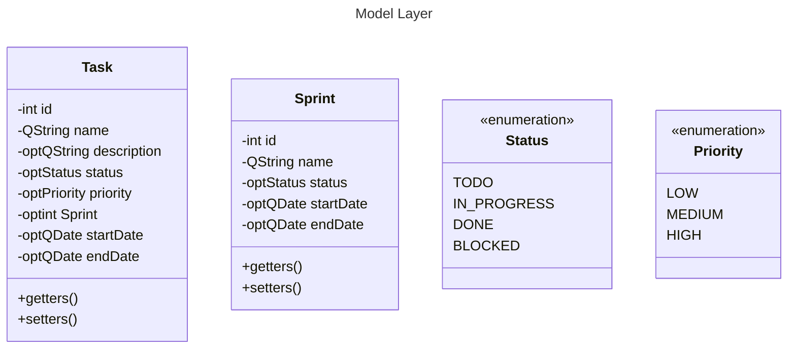

# Model Layer

```mermaid
---
title: Model Layer
---
classDiagram
    class Task {
        -int id
        -QString name
        -optQString description
        -optStatus status 
        -optPriority priority
        -optint Sprint
        -optQDate startDate
        -optQDate endDate

        +getters()
        +setters()
    }
    class Sprint {
        -int id
        -QString name
        -optStatus status
        -optQDate startDate
        -optQDate endDate

        +getters()
        +setters()
    }
    class Status {
        <<enumeration>>
        TODO
        IN_PROGRESS
        DONE
        BLOCKED
    }
    class Priority {
        <<enumeration>>
        LOW
        MEDIUM
        HIGH
    }
    
```